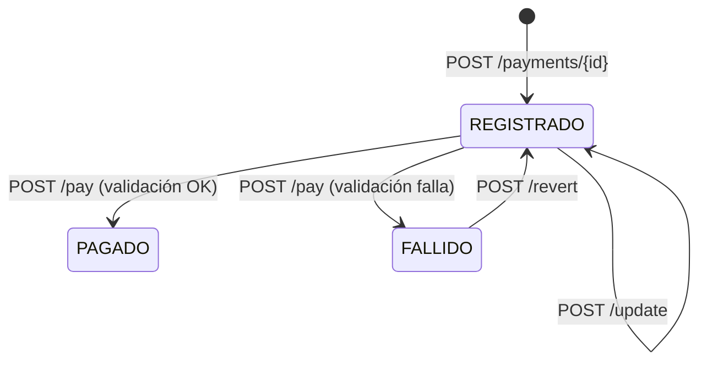
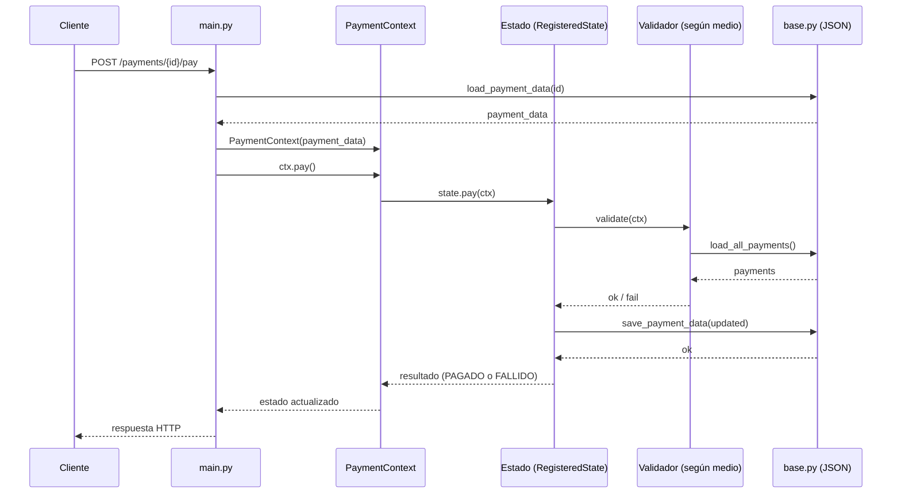

# MIA203 - Ingeniería de Software y de Datos (grupo 2025)

## Examen Unidad 1 

## Grupo 8 : Hugo Cabaña - Bruno Francisco Barra Atarama

## 1. API en producción (Render)

- URL Documentación Interactiva (OpenAPI): https://grupo-8-hugoc-brunof-4pgt.onrender.com/docs

## 2. Ejecución local

### 2.1. Requisitos

* Python 3.11+
* pip

### 2.2. Crear entorno e instalar dependencias

Linux/macOS:

```bash
python -m venv .venv
source .venv/bin/activate
python -m pip install -U pip
pip install -r requirements.txt
```

Windows (PowerShell):

```powershell
python -m venv .venv
.venv\Scripts\Activate.ps1
python -m pip install -U pip
pip install -r requirements.txt
```

### 2.3. Levantar el servidor (modo desarrollo)

```bash
fastapi dev main.py
```

Luego abrir:

* Página de documentación y pruebas de la API (OpenAPI): [http://127.0.0.1:8000/docs](http://127.0.0.1:8000/docs)

### 2.4. Ejecutar tests

```bash
pytest -q
```

Notas:
- Los tests redirigen la persistencia a un archivo JSON creado en un directorio temporario del sistema (creado con `tempfile.mkdtemp()`).
- Para lograrlo, en `setup_module` se sobrescribe `src.base.DATA_PATH` para que apunte a ese `data.json` temporal, y luego se elimina el directorio al finalizar los tests.

## 3. Diseño y patrones de diseño

### 3.1. Estructura del proyecto (responsabilidades por archivo)

* `main.py`: capa HTTP (endpoints). Orquesta el flujo: lee/escribe la persistencia y delega operaciones de dominio en `PaymentContext`.
* `payment_context.py`: contexto del pago. Mantiene la información del pago (id, monto, medio, estado actual) y delega el comportamiento a un objeto “estado”.
* `states.py`: implementa el comportamiento permitido según el estado del pago (REGISTRADO, PAGADO, FALLIDO) y define transiciones.
* `validators.py`: reglas de validación específicas por medio de pago (por ejemplo, límites de monto y regla de tarjeta).
* `base.py`: persistencia simple en JSON (leer/guardar pagos), utilizada por la API y por validadores.

### 3.2. Patrón Estado (State) para el ciclo de vida del pago

**Problema:** las operaciones disponibles dependen del estado del pago. Por ejemplo:

* `update` solo debería ser posible si el pago está **REGISTRADO**.
* `revert` solo debería ser posible si el pago está **FALLIDO**.
* `pay` solo debería ser posible si el pago está **REGISTRADO**.

**Solución aplicada:** se modela el comportamiento con un **Patrón Estado**, donde el `PaymentContext` delega `pay`, `update` y `revert` al estado actual. Cada estado encapsula sus reglas y transiciones.

**Ventajas**

* Reglas por estado encapsuladas (evita condicionales repetidos y dispersos).
* Facilita extensión (agregar estados/transiciones) con cambios localizados.
* Mejora testabilidad: se prueban reglas por estado de manera focalizada.

**Costos / contras**

* Más clases/archivos (mayor “costo estructural” que un enfoque con condicionales).
* Requiere mantener consistencia entre estados, transiciones y persistencia.

**Alternativas consideradas**

1. **Condicionales (`if/elif`) por estado** dentro de un método central o en los endpoints

   * Pros: más simple con pocos estados.
   * Contras: aumenta acoplamiento y riesgo de regresiones; se vuelve difícil mantener y testear cuando crece.
2. **Tabla de transiciones + `Enum`** (máquina de estados declarativa)

   * Pros: transiciones visibles como “datos”.
   * Contras: el comportamiento asociado a cada transición suele terminar igualmente en condicionales o funciones auxiliares; con reglas de negocio, no siempre reduce complejidad.

**Diagrama de estados (ciclo de vida del pago)**



### 3.3. Validación por medio de pago (Strategy)

**Problema:** cada medio de pago aplica reglas diferentes, y esas reglas pueden evolucionar.

**Solución aplicada:** se implementa una variante del patrón **Strategy**, definiendo un validador por medio de pago. Una función fábrica selecciona el validador según `payment_method`.

**Ventajas**

* Extensible: agregar un nuevo medio implica agregar un nuevo validador.
* Separación de responsabilidades: las reglas de negocio del pago no quedan mezcladas con la capa HTTP.
* Tests más claros: se validan reglas específicas de cada medio.

**Costos / contras**

* Más código “estructural” (clases/funciones) que un `if/elif`.

**Alternativas consideradas**

1. `if/elif` en el endpoint `/pay`

   * Pros: directo con 2 medios.
   * Contras: escala peor; mezcla reglas con orquestación.
2. Diccionario de funciones (`{"paypal": regla_paypal, "tarjeta": regla_tarjeta}`)

   * Pros: simple, sin clases.
   * Contras: cuando las reglas crecen y requieren más contexto, pierde claridad frente a validadores dedicados.

### 3.4. Flujo del endpoint `POST /payments/{payment_id}/pay` (diagrama de secuencia)

Este flujo resume el comportamiento principal: se carga el pago, se delega la operación `pay` al estado actual, se valida según el medio, y se persiste el nuevo estado.



## 4. Suposiciones asumidas e interpretación del flujo

Esta sección documenta decisiones que no estaban 100% determinadas por el enunciado y/o detalles de implementación relevantes para entender el comportamiento.

### 4.1. Medios de pago soportados

* Se considera soportado un método si el texto de `payment_method` contiene:

  * “paypal” (PayPal)
  * “tarjeta” o “card” (Tarjeta)
* Si no matchea ninguno de esos casos, la operación `POST /payments/{payment_id}/pay` falla (método no soportado).

Motivación: el `payment_method` se acepta como texto libre (no un enumerado), y se resuelve el validador por coincidencia de palabras clave.

### 4.2. Regla de validación para Tarjeta: “no más de 1 REGISTRADO”

Interpretamos la condición “no haya más de 1 pago en estado REGISTRADO con ese medio” de la siguiente manera:

* Al intentar pagar un pago con Tarjeta, se revisa la persistencia y se cuenta cuántos pagos están en estado `REGISTRADO` **con el mismo `payment_method`**.
* La validación es exitosa si ese conteo es `<= 1`.

Nota importante (detalle de implementación): “mismo medio” se evalúa por igualdad del string `payment_method` tal como se guardó. Por lo tanto, es necesario usar un nombre consistente (por ejemplo, siempre “tarjeta”), porque “Tarjeta de Crédito” y “tarjeta” podrían contarse como distintos aun si ambos caen en el validador de tarjeta.

### 4.3. Flujo de estado al pagar

* `POST /pay` nunca devuelve error “de negocio” si la validación falla: en vez de eso, el pago transiciona a `FALLIDO`.
* Es decir:

  * Validación OK → pasa a `PAGADO`
  * Validación NO OK → pasa a `FALLIDO`
* Los únicos errores esperables en `POST /pay` son:

  * Pagar un pago que no está `REGISTRADO` (por ejemplo, ya `PAGADO` o `FALLIDO`).
  * Método de pago no soportado.

### 4.4. Operaciones permitidas por estado

* `update`: permitido solo en `REGISTRADO`.
* `revert`: permitido solo en `FALLIDO` (vuelve a `REGISTRADO`).
* `pay`: permitido solo en `REGISTRADO`.

Esto se implementa con Patrón Estado (ver Sección 3).

### 4.5. Persistencia y concurrencia

* La persistencia es un archivo JSON. Se asume un entorno simple (evaluación / demo) sin concurrencia.
* Consecuencia: si hubiera múltiples requests concurrentes, podrían existir condiciones de carrera (lectura-modificación-escritura del JSON sin bloqueo). Para el alcance del examen, se consideró aceptable.

### 4.6. Códigos de error HTTP (convención usada)

* `404`: si el `payment_id` no existe.
* `409`: si la operación no es válida para el estado actual, si el pago ya existe al registrarlo, o si ocurre un error de negocio/validación que se expresa como excepción.

## 5. Estrategia de pruebas automatizadas
Los tests se ejecutan con `pytest -q` y utilizan `TestClient` de FastAPI para invocar los endpoints sin levantar un servidor real.

### Aislamiento de datos en tests

Los tests no utilizan el archivo `persistent/data.json` del repositorio. En `setup_module` se crea un `data.json` dentro de un directorio temporal y se redirige `src.base.DATA_PATH` para que toda lectura/escritura durante los tests use ese archivo. Al finalizar, el directorio temporal se elimina.

Nota: el archivo temporal se comparte entre los tests del módulo. Para evitar interferencias, cada test usa `payment_id` distintos.

### Tests cubiertos (T01–T14)

Archivo: `test_payments.py`

- T01 — `test_create_and_pay_paypal`: crear y pagar PayPal válido (REGISTRADO → PAGADO).
- T02 — `test_paypal_fail_and_revert`: PayPal inválido (REGISTRADO → FALLIDO) y revertir (FALLIDO → REGISTRADO).
- T03 — `test_credit_card_validation`: regla tarjeta, el segundo intento queda FALLIDO al pagar.
- T04 — `test_register_duplicate_returns_409`: registrar un id existente devuelve 409.
- T05 — `test_pay_nonexistent_returns_404`: pagar un id inexistente devuelve 404.
- T06 — `test_register_invalid_amount_returns_422`: registrar con `amount <= 0` devuelve 422.
- T07 — `test_register_empty_method_returns_422`: registrar con `payment_method` vacío devuelve 422.
- T08 — `test_pay_unknown_method_returns_409_and_keeps_registered`: método no soportado devuelve 409 y no cambia estado.
- T09 — `test_update_after_paid_returns_409`: update en PAGADO devuelve 409.
- T10 — `test_revert_registered_returns_409`: revert en REGISTRADO devuelve 409.
- T11 — `test_pay_twice_returns_409_on_second_attempt`: pagar dos veces devuelve 409 en el segundo intento.
- T12 — `test_revert_nonexistent_returns_404`: revertir un id inexistente devuelve 404.
- T13 — `test_update_nonexistent_returns_404`: actualizar un id inexistente devuelve 404.
- T14 — `test_update_registered_success`: update exitoso en REGISTRADO, verifica persistencia.


## 6. Integración continua (CI)

El proyecto cuenta con un flujo de Integración Continua (CI) en GitHub Actions para ejecutar automáticamente los tests y detectar errores temprano.

### 6.1. Cuándo se ejecuta
El CI se ejecuta cuando:
- se hace `push` a la rama `main`,
- se abre o actualiza un Pull Request hacia `main`,
- se ejecuta manualmente desde la pestaña “Actions” (ejecución manual).

### 6.2. Qué hace
En cada ejecución:
1) descarga el repositorio,
2) configura Python,
3) instala dependencias (`requirements.txt`) y `pytest`,
4) ejecuta los tests con:

```bash
pytest -q
```

Si algún test falla, el CI falla.

### 6.3. Dónde se ve el resultado

* En el Pull Request: sección “Checks”.
* En el repositorio: pestaña “Actions”, con el historial de ejecuciones.

### 6.4. Nota de evolución

En una etapa inicial el CI propuesto no estaba correctamente configurado y falló en varias integraciones. Luego se desactivó temporalmente, se corrigió y se reactivó.
Actualmente el CI corre de forma estable y, tras ampliar la suite de tests, la verificación es más exigente.


## 7. Despliegue continuo (CD)

El proyecto cuenta con un flujo de Despliegue Continuo (CD) en GitHub Actions para crear releases y desplegar automáticamente la API en Render.

### 7.1. Cuándo se ejecuta

El CD se ejecuta cuando:
- se hace `push` a la rama `production`,
- se ejecuta manualmente desde la pestaña “Actions” (ejecución manual).

### 7.2. Qué hace

En cada ejecución:
1) calcula el próximo tag semántico (vMAJOR.MINOR.PATCH) a partir de los tags existentes,
2) crea un Release en GitHub con ese tag,
3) dispara el despliegue en Render mediante un Deploy Hook (HTTP POST).

### 7.3. Versionado por mensaje de commit

El incremento de versión se controla con marcadores en el mensaje del commit:

- `[bump:major]` incrementa MAJOR (reinicia MINOR y PATCH a 0).
- `[bump:minor]` incrementa MINOR (reinicia PATCH a 0).
- `[bump:patch]` o sin marcador incrementa PATCH.

Si el tag calculado ya existe, el workflow incrementa PATCH hasta encontrar un tag libre.

### 7.4. Configuración requerida (Render)

- Render debe tener Auto-Deploy desactivado.
- GitHub debe tener configurado el secreto `RENDER_DEPLOY_HOOK_URL` (Deploy Hook de Render).
- Si el secreto no existe (o está vacío), el workflow falla antes de crear el Release.

### 7.5. Dónde se ve el resultado

- En GitHub: pestaña “Actions” (ejecución del workflow y estado).
- En GitHub: sección “Releases” (tag y release creados).
- En Render: historial de despliegues del servicio.